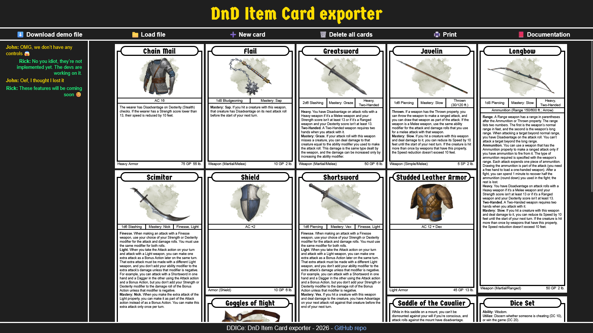

<div align="center">
<pre>
██████╗ ██████╗ ██╗ ██████╗███████╗    ██████╗  ██████╗ ██████╗ ██╗  ██╗
██╔══██╗██╔══██╗██║██╔════╝██╔════╝    ╚════██╗██╔═████╗╚════██╗██║  ██║
██║  ██║██║  ██║██║██║     █████╗       █████╔╝██║██╔██║ █████╔╝███████║
██║  ██║██║  ██║██║██║     ██╔══╝      ██╔═══╝ ████╔╝██║██╔═══╝ ╚════██║
██████╔╝██████╔╝██║╚██████╗███████╗    ███████╗╚██████╔╝███████╗     ██║
╚═════╝ ╚═════╝ ╚═╝ ╚═════╝╚══════╝    ╚══════╝ ╚═════╝ ╚══════╝     ╚═╝
</pre>
</div>

---

DDICe: DnD Item Card exporter. Create printable cards for DnD 5.5E items from a CSV file.

# 🖼️ Demo preview



# 📄 User guide

## 1. Download demo file

Download the demo file to view the structure of the CSV file.

We recommend one of these tools to edit csv files:
+ MS Office 365 Excel
+ Onlyoffice Spreadsheets
+ Google docs spreadsheets
+ Rainbow CSV VScode extension (We use this 🙌)

> [!WARNING]
> The exported csv files from [5e tools](https://5e.tools/items) are missing next the columns: `other`, `Image-url`, `Image-Scale`, `Image-Rotation`

## 2. Create CSV file

You can start from our demo file or from an exported item list from [5e tools](https://5e.tools/items).

### Using demo file

This file is ready to use.

### Using 5e.tools file

In this table you will see the missing columns of the 5e.tools file. Add these in the right order.

|**Columns**|Name|Source|Page|Rarity|Type|Attunement|Damage|Properties|Mastery|Other|Weight|Value|Text|Image-url|Image-Scale|Image-Rotation|
|:---|:---:|:---:|:---:|:---:|:---:|:---:|:---:|:---:|:---:|:---:|:---:|:---:|:---:|:---:|:---:|:---:|
|**Usage**|✔️|❌|❌|✔️|✔️|✔️|✔️|✔️|✔️|✔️|✔️|✔️|✔️|✔️|✔️|✔️|
|**5e tools**|✔️|✔️|✔️|✔️|✔️|✔️|✔️|✔️|✔️|❌|✔️|✔️|✔️|❌|❌|❌|


## 3. Add new card

Add a new card to edit in the browser.

> [!TIP]
> A card editor will be added soon. Use the browser developer function for now to edit your card.

## 4. Print

Use `Ctrl + P` or the print button to print your cards. These cards are designed to use the same size as Pokemon cards (2.5in X 3.5 in).

# 📩 Commit messages

```
[ACTION] message
```

#### Actions

+ **SAVE:** save code to personal development branch
+ **UPDATE:** update finished code to development branch
+ **FIX:** fix a bug or issue
+ **REFACTOR:** refactor code without changing functionality
+ **DOCS:** only changed documentation
+ **STYLE:** only changed syntax, user style
